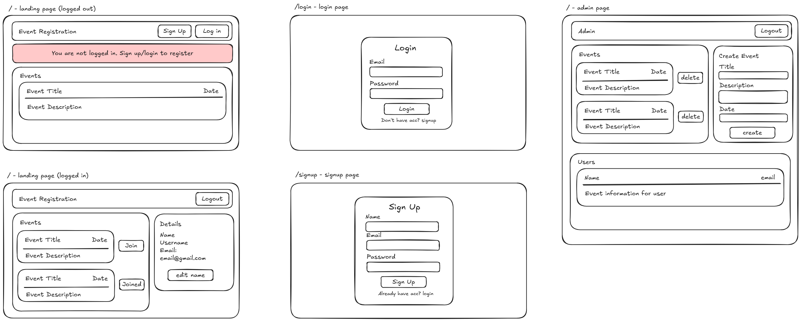

# Registration Platform
Mini registration platform for events using the MERN stack.

## Codebase Structure

The codebase is separated into a backend folder (handles server side code) and the frontend directory (handles client side code).

### Basic Code Structure
```
frontend/
-- src/
-- -- assets/       // any assets used
-- -- components/   // reusable frontend components
-- -- context/      // context used with useContext
-- -- hooks/        // custom hooks
-- -- pages/        // pages for the application
-- -- styles/       // styles
-- -- App.jsx       // handles frontend routing
-- -- main.jsx      // main entry - has context wrappers

backend/src/main/java/com/nzpmc/kyum151/
-- competitions/    // contains competition related classes
-- config/          // contains configuration classes
-- events/          // contains event related classes
-- exceptions/      // contains exception classes
-- services/        // contains services for the application
-- users/           // contains user related classes   
```

## Key Decisions
One of the key decisions I had to make was how to handle authentication and authorization. I needed to ensure both my API routes and my React routes were protected, allowing access only to authorized users while preventing unauthorized users from viewing restricted content.

For this, I chose to use JSON Web Tokens (JWT) and `localStorage`.
- JWT was used to authenticate users as they could be generated upon successful login and sent to the client. These can then be used to control access to the React routes. They are also sent with each API request to protected routes to validate access to protected resources.
- `localStorage` was used to store the JWT token persistently on the client side. This allowed the user to remain logged in even if they refreshed the page, providing a smoother user experience.

I also chose to have two global state contexts wrapping my application. These were the `AuthContext` and `EventContext`.
- `AuthContext` was responsible for handling authentication and authorisation, keeping track of session state and providing methods to login and logout.
- `EventContext` was responsible for fetching and storing events, as well as managing any updates to the state of events.

Both the `auth` and `event` states were made global so that any component can access the state of the two contexts. I implemented it this way as the state of the current session and the state of the events did not need to be protected and was accessible even when not logged in.

I have also added filters for both the event lists and the user lists so that user can access the resources that they want easily.

I used express router for my backend API routes as that made it easy for me to add middleware to specific routes. This enabled me to protect backend API routes from unauthorised access more easily.

### Project 2:
I've kept most features of project 1 the same and migrated the node backend to a springboot backend. For example, I am still handling authentication using JWT tokens via a `FilterChain` in java.

A decision that I made on the backend was to group my files by their feature instead of their role. For example, instead of having `backend/controllers`, `backend/services`, `backend/models`, I have `backend/competitions`, `backend/users`, `backend/events` with the controllers, models and services together in one file. This made it easier for me to find the files that I needed to work on.

I've also added another React context `CompetitionContext` that handles the state of all competitions globally. This became important for the competition page where I needed the start and end times of all competition in order to work out what component that user is able to interact with.

## Extra Features
- Global State Management using `useContext`
- Protected routes in both frontend and backend using JSON Web Tokens
- Persistent Sessions using tokens stored in `localStorage`
- Password hashing using `bcrypt`
- Use of polling to have a countdown timer as the user is attempting a competition

## Project Wireframe

The project wireframe was kept the same as the one provided with a few minor tweaks (most routes are the same)

Changes:
- Logging in as the admin user will redirect you to the /admin page, not the / (landing) page. Logging in as any other user will redirect you to the landing page.
    - This made sense as I have made it so that admin cannot join events (hence they are also filtered from the user list in the admin page).

## Backend API Documentation
Backend API documentation have all been moved to the `docs/api/` folder.
See [here](docs/api/) for more information.
